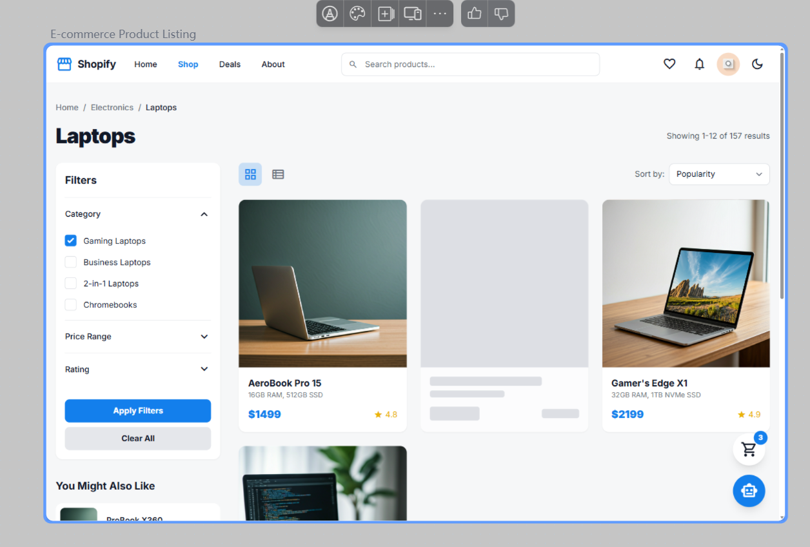
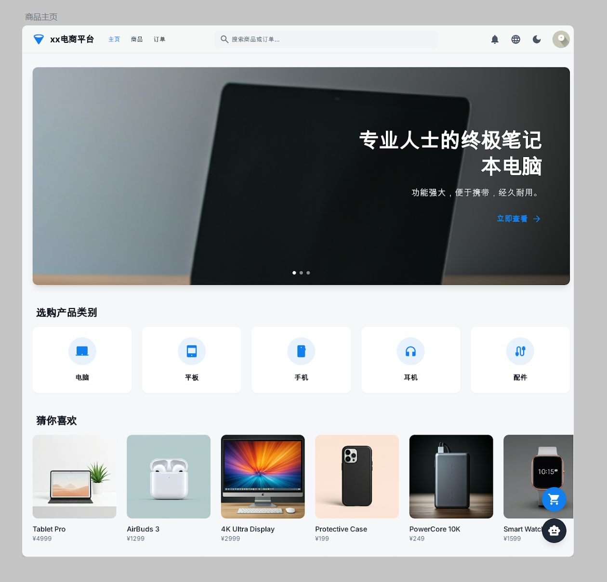
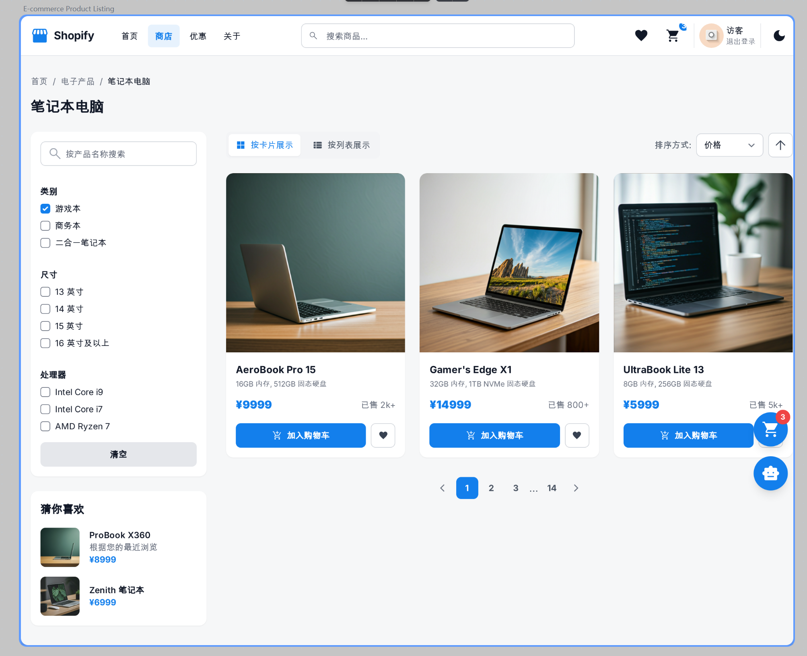
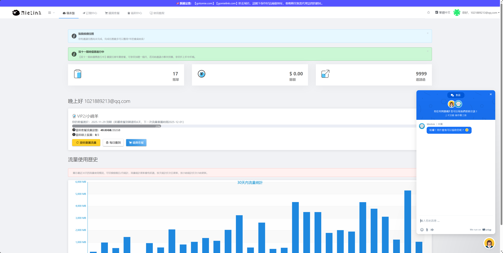
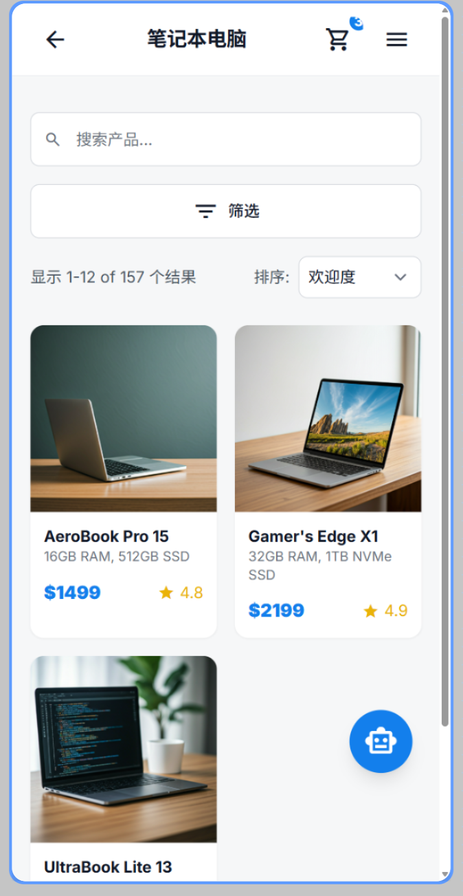

# 电商平台 规划

## 介绍

- 整体定位：“轻舟商城”，科技公司的产品商店，类似 Apple Store、Google Store  
  _注：轻舟(CockleBoat) 是以前我参加的一个比赛所组织的一个团队，这里只是拿来用而已。_
- 商品类别
  - 电脑
    - 类别：游戏本、商务本、……
    - 尺寸
    - 处理器
    - 显卡
    - ……
  - 平板
    - 系列：Air、Pro
    - 尺寸
    - ……
  - 手机
  - 耳机
  - 配件

## 整体页面布局

- 登录系统
- 主系统
  - Header
    - 左侧
      - 标识：xx电商平台
      - 页面选项卡：主页、商品、订单
    - 中间
      - 全局搜索栏：点入后采用modal形式，中间展示搜索结果，下方可选是搜索“商品”/“订单”
        - 只根据名称（商品则是商品名、订单则是购买的商品名）进行匹配：按照列表展示最相关的若干条
          - 商品搜索结果展示：名称、类别、金额
          - 订单搜索结果展示：名称、下单日期、当前状态（待付款、运输中、待签收、已完成）
    - 右侧
      - 通知
      - 语言
      - 主题
      - 个人信息
  - Content（只考虑“商品”页面）
    - 页面1 - 商品主页
      
      - 首先夺人眼球的轮播图：展示核心商品
      - 其次猜你喜欢的滑动栏
      - 然后是产品类别选项：电脑、平板、手机、耳机、配件
    - 页面2 - 分类/搜索页
        
      _注：只是示意图，有部分内容不符合，具体按本文档为准。_
      - 上方面包屑：商品主页/类别(或者搜索词条)
      - 左侧
        - 筛选栏：
          - 搜索栏：根据商品名称进行搜索
          - 各筛选选项：根据所选类别的子类别标签进行展示（比如进入电脑类别，则展示“类别/尺寸/处理器”等）
          - 当有筛选条件后，标题右侧出现清空按钮
          - 没有应用筛选按钮，当条件改变后自动筛选
        - 猜你喜欢
      - 右侧 - 商品展示
        - 上方左侧：按卡片展示/按列表展示
        - 上方右侧：排序选项
          - 价格（从高到低、从低到高）、销量（从多到少、从少到多）、上架时间（最新上架、最早商家）
        - 商品展示部分：卡片/列表
          - 卡片/列表
          - 展示：图片、名称、描述、价格、销量、加入最爱、加入购入车
      - 右下角悬浮按钮
        - 购物车：点击后在右侧展开竖直的modal（背景虚化）
        - AI对话：点开后在右侧展开对话框（不如modal那么侵入，类似于下图的右下角）  
          

移动端，可暂时参考如下：

## 需求分析

### 功能需求

#### 核心功能

1. 商品列表展示：以卡片或网格布局呈现商品核心信息（含商品图片、名称、价格、销量等）；
2. 多条件筛选：支持按分类、价格区间、销量、评分等维度进行组合筛选，筛选状态实时同步；
3. 灵活排序：提供价格（升序 / 降序）、销量（降序）、上架时间（最新 / 最热）等排序选项，切换后列表实时更新；
4. 分页功能：实现分页控制（含页码切换、每页条数选择），支持快速跳转至指定页码，分页状态与列表数据联动。

#### 可选功能

1. AI 推荐：猜你喜欢
2. AI 对话：用于当用户无法精确定位搜索商品时，AI 根据描述进行筛选
3. 可以有个简单的登录机制，也采用mock最简实现，但全流程符合标准跑通。

### 性能需求

1. JS 性能优化：async/await 等
2. React 性能优化：useMemo 等
3. 节流防抖：在必要的地方使用防抖节流优化性能，比如
4. 虚拟滚动：当商品数据量（根据筛选、每页条数决定）超过一定数量时自动启用

### UI/UX 需求

1. 主题：支持普通、黑暗主题，支持用户自定义主题色
2. 响应式：采用响应式最佳实现，支持手机、平板、电脑三端
   - 桌面端：按照上方整体界面布局实现
   - 移动端：
3. 加载骨架图/骨架屏
4. 动效：通过动效优化 UX 体验，如
   1. 商品卡片：hover时三维悬浮展示卡片，根据鼠标位置进行悬浮
   2. 主要按钮反馈：如添加喜欢、添加购物车

### 其它需求

1. 国际化：使用 i18n 最佳实践，适配中文（默认）和英文
2. 本地存储：本地存储购物车信息

## 技术栈

- 框架: React 18
- 语言: TypeScript
- 构建: Vite
- UI库: shadcn/ui (Radix UI + Tailwind CSS)
- 状态管理: Zustand
- 请求管理: TanStack Query
- 路由：React Router
- 动画库
- i18n
- ……

## 其它说明

- 数据来源：使用假数据（Mock），但前端应当有完整的与后端交互方式（即API、Service等，调 fetch 请求获取数据），不过后端是个mock的
